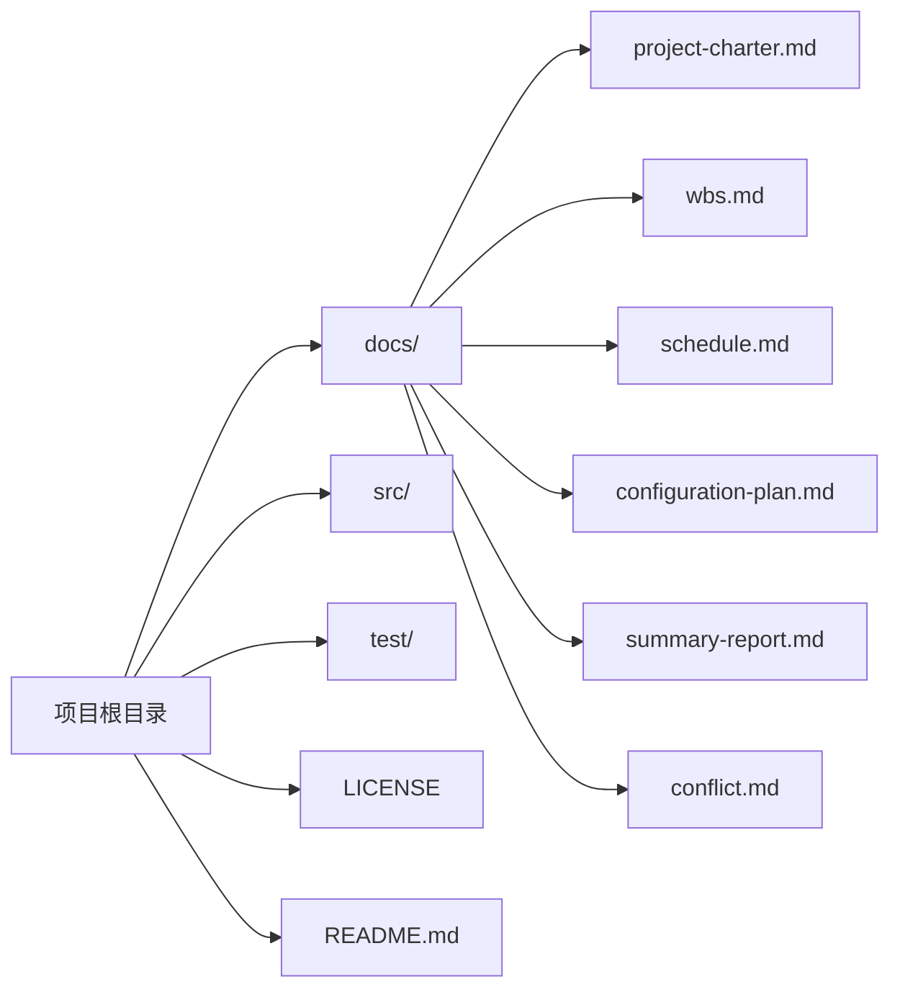

# 配置管理方案 - 校园活动报名与签到管理系统

> 文档版本：v1.1
> 编制人：李佳豪
> 编制日期：2026-05-16

## 1 软件配置管理（SCM）

### 1.1 SCM 组织

| 角色 | 姓名 | 职责范围 |
|------|------|----------|
| 配置管理员 | 李佳豪 | 负责配置管理活动的整体执行，包括配置库维护、分支管理、版本标记 |
| 项目经理 | 任俊 | 负责审批配置变更、主持变更控制委员会 |
| 计划负责人 | 李佳豪 | 负责审批 feature → dev 的合并请求 |
| 协作成员 | 任俊 | 负责按规范提交配置项、参与配置审核 |

### 1.2 SCM 责任

| 责任项 | 责任内容 | 责任人 |
|--------|----------|--------|
| 配置库管理 | 创建和维护项目配置库，管理分支和标签 | 配置管理员 |
| 配置标识 | 识别和定义所有配置项，建立基线 | 配置管理员 + 项目经理 |
| 配置控制 | 执行变更控制流程，维护变更记录 | 项目经理 + 配置管理员 |
| 配置状态报告 | 定期报告配置状态，发布版本信息 | 配置管理员 |
| 配置审核 | 组织配置审核活动，验证配置完整性 | 配置管理员 + 项目经理 |

### 1.3 SCM 与项目中其他机构的关系

> 注：原模板中该节未展开具体内容，此处保留标题。

## 2 软件配置管理活动

### 2.1 配置标识

#### 2.1.1 配置项的标识

| 配置项ID | 配置项名称 | 存放位置 | 负责人 | 命名规范 |
|----------|------------|----------|--------|----------|
| CI-01 | 项目章程 | docs/project-charter.md | 任俊 | 小写字母+连字符 |
| CI-02 | WBS分解文档 | docs/wbs.md | 李佳豪 | 小写字母+连字符 |
| CI-03 | 简化进度计划 | docs/schedule.md | 李佳豪| 小写字母+连字符 |
| CI-04 | 配置管理方案 | docs/config-plan.md | 李佳豪 | 小写字母+连字符 |
| CI-05 | 源代码 | src/ | 全体开发人员 | 根据语言规范 |
| CI-06 | 冲突示例文件 | docs/conflict.md | 配置管理员 | 小写字母+连字符 |
| CI-07 | 项目总结报告 | docs/summary-report.md | 全体成员 | 小写字母+连字符 |

**配置项版本格式**：`v<主版本>.<次版本>.<补丁版本>`

#### 2.1.2 项目基线

| 基线名称 | 包含配置项 | 状态 |
|----------|------------|------|
| 项目启动基线 | CI-01, CI-02, CI-04| 已建立 |
| 开发完成基线 | CI-05 | 计划中 |
| 交付验收基线 | CI-07,所有文档最终版 | 计划中 |

#### 2.1.3 配置库

本项目使用 **GitHub** 作为配置库，库地址：[待填写仓库URL]

**配置库目录结构**：

## 2.2 配置控制程序

#### 2.2.1 变更基线的规程

1. **提出变更**：由项目任何成员在GitHub Issues中提出变更申请
2. **执行变更**：在feature分支上实施变更
3. **更新版本**：更新配置项版本号和变更记录
4. **合并发布**：合并到相应分支

#### 2.2.2 用于执行变更控制的工具

| 工具 | 用途 |
|------|------|
| GitHub | 配置库、版本控制、PR审核 |
| VSCode + Git | 本地变更操作 |

### 2.3 配置状态报告

#### 2.3.1 项目媒体的存储、处理和发布

| 媒体类型 | 存储位置 | 处理方式 | 发布方式 |
|----------|----------|----------|----------|
| 文档（Markdown） | GitHub仓库 | Git版本控制 | GitHub页面 |
| 源代码 | GitHub仓库 | Git版本控制 | GitHub拉取 |

#### 2.3.2 需要报告的信息类型及控制

| 信息类型 | 内容 | 访问控制 |
|----------|------|----------|
| 配置项状态 | 版本号、最后修改人、最后修改时间 | 全体成员可查看 |
| 变更记录 | 变更ID、申请人、状态、审批结果 | 全体成员可查看 |
| 版本发布信息 | 版本号、发布日期、包含内容 | 全体成员可查看 |

### 2.4 配置审核

#### 2.4.1 审核安排

| 审核事件 | 审核基线 | 审核人 | 审核对象 | CM任务 | 
|----------|----------|--------|----------|--------|
| 启动阶段审核 | 项目启动基线 | 项目经理 | CI-01, CI-02, CI-04 | 提供配置项清单 | 
| 开发完成审核 | 开发完成基线 | 全体成员 | CI-05+全部文档 | 检查分支合并状态 | 
| 交付验收审核 | 交付验收基线 | 项目经理+项目发起人 | 全部配置项 | 制作发布包 | 

#### 2.4.2 配置管理评审

**评审1：项目中期评审**

| 项目 | 内容 |
|------|------|
| 待评审材料 | WBS文档、进度计划、配置管理方案执行情况 |
| CM责任 | 提供配置状态报告、变更统计、分支结构图 |
| 其他机构责任 | 计划负责人提供进度符合性说明；项目经理提供整体评价 |

**评审2：项目验收评审**

| 项目 | 内容 |
|------|------|
| 待评审材料 | 所有文档最终版、冲突解决记录、Git提交日志 |
| CM责任 | 提供完整配置项清单、版本标记记录、审核报告 |
| 其他机构责任 | 全体成员确认各自负责的配置项已完成 |
